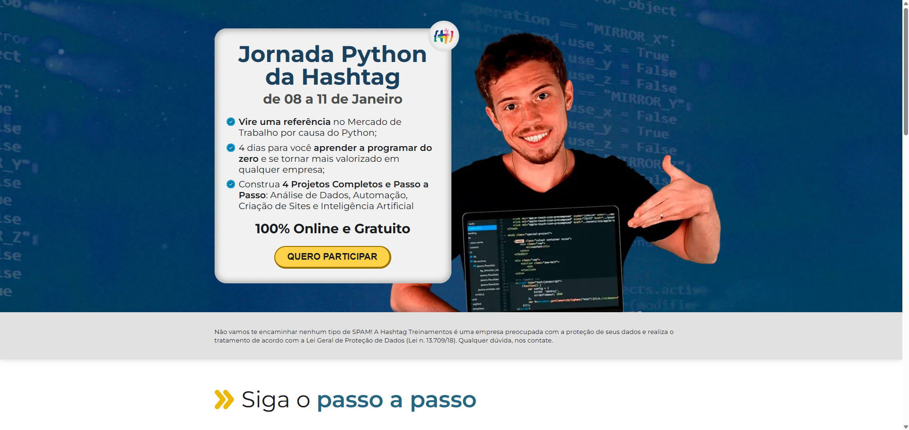

# 🚀 Clone - Página de Captura Hashtag Treinamentos

Um clone responsivo e de alta fidelidade visual da página de inscrição da **Jornada Python**. O foco deste projeto foi consolidar conhecimentos avançados de estruturação HTML semântica e estilização modular com CSS/Sass.

## 📸 Interface do Projeto

## 🔗 Demonstração Online

O projeto está publicado e pode ser testado diretamente no seu navegador:
👉 [Acessar a Página de Captura ao vivo](https://lucasbonner6.github.io/PaginaDeCapitura/)

## 🛠️ Tecnologias Utilizadas

- **HTML5:** Estruturação totalmente semântica utilizando divisões limpas em blocos (`secao--hero`, `container`, `caixa__titulos`), otimizando a acessibilidade e SEO.
- **CSS3 / Sass (SCSS):** Organização profissional dos estilos através de pré-processamento. Compilado e minificado em arquivos separados (`style.css`, `style.prefix.css`) para garantir compatibilidade e carregamento otimizado.
- **Otimização de Performance:** Uso de tags `<link rel="preload">` e `<link rel="preconnect">` para adiantar o carregamento dos estilos críticos e das fontes do Google (_Montserrat_), evitando o efeito de "pulo" no texto (FOIT).
- **Google Fonts:** Tipografia moderna integrada perfeitamente com pesos de fonte variados (400, 600, 700).

## ⚡ Estrutura e Boas Práticas Front-End

- 📦 **Metodologia BEM (Block Element Modifier):** Classes organizadas de forma previsível e escalável (ex: `caixa__titulo--cinza`).
- 🔄 **Redirecionamento Inteligente:** Configuração de um arquivo `index.html` na raiz que serve como ponte automática para o arquivo `inscricao.html`, garantindo o funcionamento do deploy sem quebrar a nomenclatura original das suas páginas.
- 📱 **Layout Adaptável:** Desenvolvido pensando na experiência fluida tanto em desktops quanto em telas menores.
